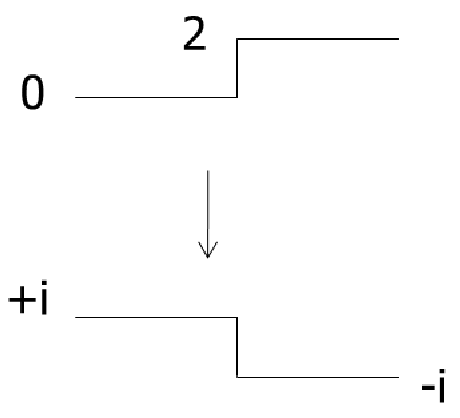

# Part I - Linear phase FIR filters {.section-silde}



::: {.notes}

In this lesson we will study of to design filters

So we can choose between two type of filters: recursive (that may have infinite impulse response) and FIR filters

Let s start with the FIR filters.

:::

## Linear phase FIR filters {.small-slide}

Impulse response: 
$$h(n) \in \RR, \quad n= 0, \ldots, N-1$$

Frequency response:
$$H(\eipiv) = e^{i 2 \pi (\beta - \alpha \nu)} H_R(\nu)$$

::: {.notes}

The impulse response of a FIR is composed bit a finite number of $N$ of non-zeros coefficients.

We assume here the case of **real and causal**

Then, the frequency response can be factorized in a real continuos function $H_R$ multiplying a complex **linear phase component** of the continuous variable $\nu$.

:::

. . .

Constant and equal group and phase delays (if $\beta = 0$)

::: {.notes}

THe main advantage of these filters is that the phase delay is constant with the frequency

If the input signal has its frequency support in the passband, then the waveform of the output is similar to the one the input: 

- the components are processed without getting out of phase with one another

Let s verify this, derivation on the whiteboard

:::

. . .

[Advantages:]{.fg}

- always **causal and stable**
- preserve the waveform af a narrow-band signal (if $\beta = 0$)

[Drawbacks:]{.fg} high computational complexity

::: {.notes}

The main advantage of the FIR filters is 
- the possibility of synthetize them with exact linear phase in frequency, 
- allowing the conservation of the filtered waveforms

However, they require often a computational complexity much greater than the recursive filter for the same function

Also, FIR filters have smaller sensitivity to rounding errors, due to their non-recursive nature.

- meaning that these error do not propagate. 
- In the case of FIR filter instead, error due to finite precision may propagate and causes instabilities if the poles are near the unit circle

:::

## Characterization {.tiny-slide}

$$H(\eipiv) = e^{i 2 \pi (\beta - \alpha \nu)} H_R(\nu)$$

::: {.notes}

To find the shape of the impulse response of this type of filters, we will use two properties

- The first one is the 1-periodicity of the tranfer function, that leads to know that the $H_R$ components is 2-periodic
- and the Hermitian symmetry of the transfer function implies that $H_R$ is even or odd

:::

[Properties]{.fg}

- **1-periodicity** of $H(\eipiv) \implies \alpha = p/2, p\in \ZZ$ $\implies$ $H_R$ is "2-periodic" (to be proved)
- **Hermitian symmetry** $\implies$ $d = e^{2 i \pi \beta}=1$ or $i$ $\implies$ $H_R$ is even or odd (to be proved)

. . .

Then, we can define $G(\eipiv)= d H_R(2 \nu)$ where $g(n)$ is real, even or odd

We can thus write $H(z^2) = z^{-p} G(z)\quad$ (filter of length $2N-1$)

We choose $p = N -1$ for a  causal filter

::: {.notes}

Then we can define a transfer function of the filter $G$ than is 2 periodic of $H_R$ and multiplied by 1 or $i$.

This implies that the impulse response will be real, even or odd

Then we can see that taking the impulse response $g(n)$,

- delaying it by an offset of $p$ samples
- and multiplying by $d$ (one or $i$)
- we obtained an inteporalted version of the filter $h(n)$

:::

. . .

[4 possibilities:]{.fg} depending on $d$ and the parity of $N$:

  - $d=1$, $N$ even or odd: $h(n) = h(N-1-n)$
  - $d=i$, $N$ even or odd: $h(n) = - h(N-1-n)$

::: {.notes}

Then we have 4 possibilities:

- two for the choice of the $d$, either 1 or $i$
- two for the parity of $N$, either odd or even

This lead to FIR filters that exhibit porperties which make it suitable for specific uses.

Note that, $H_R$ is what is left to the engineer to optimize, while the phase is constarted by the FIR design.

For instance if we want to design different passband filters

:::

## Types of linear FIR filters {.small-slide}

::: {.notes}

We have the Type I and Type filters that 

:::

::: {.panel-tabset}

## Type I

::: {.columns}

::: {.column}
 
$N$ odd, symmetric ($d=1$)

$$
H(\eipiv) = e^{- i 2 \pi \nu \frac{N-1}{2}} \sum_{n=0}^{\frac{N-1}{2}} a_n \cos(2\pi \nu n)
$$

Use: low-pass, high-pass, band-pass

:::

::: {.column}
 
 

{fig-align="center"}

:::

:::

## Type II

::: {.columns}

::: {.column}
 
$N$ even, symmetric ($d=1$)

::: {.small}
$$
H(\eipiv) = e^{- i 2 \pi \nu \frac{N-1}{2}} \sum_{n=0}^{\frac{N-1}{2}} b_n \cos\left(2\pi \nu \left(n - \frac12\right)\right)
$$
::: 

Property: 
$$ 
  H(-1)=0 \quad (\nu=\frac12)
$$

Use: low-pass, band-pass

:::

::: {.column}
 
 

{fig-align="center"}

:::

:::

## Type III

::: {.columns}

::: {.column}
 
$N$ odd, anti-symmetric ($d=i$)

$$
H(\eipiv) = e^{- i 2 \pi \nu \frac{N-1}{2}} \sum_{n=0}^{\frac{N-1}{2}} c_n \sin (2 \pi \nu n)
$$

Property:
$$
  H(1)=H(-1)=0 \quad (\nu=0 \text{ or } \frac12)
$$

Use: 

  - Differentiator: $H(f)=i 2 \pi f$
  - Hilber transform: $H(f)= - i \sign(f)$ in bass-pass form

:::

::: {.column}
 
 

{fig-align="center"}

:::

:::

## Type IV

::: {.columns}

::: {.column}
 
$N$ even, anti-symmetric ($d=i$)

::: {.small}
$$
H(\eipiv) = e^{- i 2 \pi \nu \frac{N-1}{2}} \sum_{n=0}^{\frac{N-1}{2}} d_n \cos\left(2\pi \nu \left(n - \frac12\right)\right)
$$
:::

Property: $H(1)=H(-1)=0 \quad (\nu=0 \text{ or } \frac12)$

Use: 

  - Differentiator: $H(f)=i 2 \pi f$
  - Hilber transform: $H(f)= - i \sign(f)$ in high-pass form

:::

::: {.column}
 
 

:::

:::

:::

## Differentiatiors {.small}

::: {.notes}

We will now see two special filters that we mentioned before.

The first one are differientiation filters

Filters type III and IV can be used to approximate the frequency response $H(\eipiv)=i 2 \pi \nu$, which corresponds to the derivation operation

Thefore we can use one of the previus filter with $d=1$

:::

$$
  d=1 \quad\implies\quad H(\eipiv)= i 2 \pi \nu
$$

. . .

{fig-align="center" width=50%}

::: {.center .small}
Differentiator filter of order 20 applied to a triangle sequence
:::

::: {.notes}

In practice, we need to correct the delay related to the filtering

This filters features a zero in the frequency response at $\nu=0.5$, resulting to the highest frequency of the passband is fixed ad $\nu=0.45$

Also, as you can notice, the Gibbs phenomenon is evident in the transition of the square sequence
:::

## Hilbert tranform {.small-slide}

::: {.notes}

These filters perform an approximation of the Hibert tranform, which give access to the analytic signal.

An analytic signal is the complex signal associated with a real signal, 

- that have not negative frequency components
- and whose the real and imaginary part of this signal are real functions related via Hilbert transform

We can use the filters Type III and Type IV to extract it because the frequency response contains the phase factor $e^(i \pi / 2)$ 

Then filtering a real signal $x(n)$ provides a signal $x_h(n)$ such that 
$$
  x_a(n) = x(n) + j x_h(h), \quad x_h(n) = \{h \ast x\}(n)
$$

:::

$$
x_a(n) = x(n) + i x_h(h), \quad x_h(n) = \{h \ast x\}(n)
$$

. . .

<!-- ::: {layout="[50,30]" layout-valign="center"} -->
{fig-align="center" width=50%}

<!-- {fig-align="center"} -->

::: {.center .small}
Hilbert filtering of sinusoidal sequence $x(n)$ of freq. $\nu_0=0.05$, filter lenght $N=61$
:::

<!-- ::: -->

::: {.notes}

This figure here shows the results and the frequency response of the Hilbert filter implementing a passband filter:

This means that we perform the hilbert transform in that selected frequencies

In reality, the filter has a transition state and the steady state is reached only after the filter lenght samples - 1, because of the ripples in the passband

THis imperfections are hardly visibile becasue of the choosen order of the filter here.

:::

## Position of the zeros

Complex zero outside the unit circle

$$
  (1 - \rho e^{i \theta} z^{-1})
  (1 - \rho e^{-i \theta} z^{-1})
  (1 - \frac1\rho e^{i \theta} z^{-1})
  (1 - \frac1\rho e^{- i \theta} z^{-1})
$$

{width="50%" fig-align="center"}

::: {.notes}

Let be $\rho$ a zero of $H(z)$

Since $h(n)$ is real, then also ${\rho^\ast}$ is a zeros of $H(z)$

If $\rho\ne 0$, $h(n)$ is either symmetric or anti-symmetric, and also $1/\rho$ and $1/{\rho^\ast}$ are zeros of $H(z)$

We can easily prove it

$$
H(\frac{1}{\rho}) 
  = \sum_{n=0}^{N-1} h(n)(\frac{1}{\rho})^(-n)
  = \sum_{m=0}^{N-1} h(N - 1 - m)(\frac{1}{\rho})^(N+1-m)
  = \rho^{N-1}\sum_{m=0}^{N-1} h(m)(\frac{1}{\rho})^(-m)
  = \pm \rho^{N-1} H(\rho)
$$
for $m = N - 1 - n$

:::

## Position of the zeros

::: {layout-ncol="3"}

::: {.column}
Zero on the unit circle

:::

::: {.column}
Real zero

 

:::

::: {.column}
Real zero on the unit circle

:::

:::

## Summary {.tiny-slide}

::: {layout-ncol="4" layout-align="center" style="text-align:center"}

Type I\
$N$ odd\
symmetric

-

Low-Pass\
High-pass\
Band-pass

:::

::: {layout-ncol="4" layout-align="center" style="text-align:center"}

Type II\
$N$ even\
symmetric

$H(-1) = 0$

Low-Pass\
Band-pass

:::

::: {layout-ncol="4" layout-align="center" style="text-align:center"}

Type III\
$N$ odd\
anti-sym.

$H(1)=H(-1) = 0$

Differentiator\
Hilber Transform\
Band-pass

:::

::: {layout-ncol="4" layout-align="center" style="text-align:center"}

Type IV\
$N$ even\
anti-sym.

$H(1)- = 0$

Differentiator\
Hilber Transform\
High-pass

:::

# Part II - FIR filters: iterative methods {.slide-section}

::: {.notes}

These methods consists in defyining some properties of the desired filters

and optimiza a criterion, called the Chebyshev error criterion, to estimate the filter parameter.

The criterion is met using iterative like the Remez's exchange algorithm

:::

## Iterative methods {.small-slide}

[Advantages]{.fg}

- Optimal design
- Flexible method
- Constant amplitude ripples
- Minimum order for a given *template*

::: {.notes}

The iteravite methods benefits of the following advantages

- the achive a optimal design, in term of error variance and global minimum
- are relatively flexible thanks to the template to define the shape of a filter
- they guarantees ripple of constant amplitudes
- and return the minimun order filter for the given template
:::

. . .

[Drawbacks]{.fg}

- Computational demanding **synthesis**
- Not suitable for real-time processing
- Not suitable for long filters ($\to$ numerically stability issues)

::: {.notes}

Of course there is no free lunch

The drawbacks are that

- the sythesis is computationally demanding (that is, computing the filter)
- therefor they are not suitable for real-time processing
- and suffer for numerical insatbility for high-order filters

:::

## Filter template {.small-slide}

::: {.notes}

Let s start with the defitinion of the filter template

that is the parameterization of the shape of the desired filter

:::

. . .

::: {.notes .small}
- that is, specifying the maximum allowable limits for the modulus of its frequency response

For instance, let s consider here a low-pass filter, which will be easy to generalize to other types of filter later

- the limits of the modulus of the frequency response are given in terms of 
  - maximum ripple $\delta_1$ in the passband 
  - and maximum ripple $\delta_2$ in the stopband

Typically these parameters are defined in dB

The width of the transition band which will be very narrow for a more selective filter

- defined between two frequencies $\nu_c$ and $\nu_a$

This template assume typically unitary gain and are normalized to 1 in the passband

:::

::: {layout="[50,50]" layout-valign="center"}

:::

## Parameterization of $H_R$ {.small-slide}

::: {.notes}

Then, we can notice that the H_R of the four types of FIR filters can be parameterized as the product of two filters P and Q

and whose forms are given in this table

In particular:

- Q is specific to each type of filter
:::

Factorization $H_R(\nu)=P(\nu)Q(\nu)$

::: {.small}
$$
\begin{array}{|c|c|c|}
\hline
H_R(\nu) & P(\nu) & Q(\nu) \\ \hline
\sum\limits_{n=0}^{\frac{N-1}{2}} a_n \cos(2\pi \nu n) & \sum\limits_{n=0}^{\frac{N-1}{2}} a_n \cos(2\pi \nu n) & 1 \\
\sum\limits_{n=1}^{\frac{N}{2}} b_n \cos\left(2\pi \nu \left(n-\frac{1}{2}\right)\right) & \sum\limits_{n=0}^{\frac{N}{2}-1} b'_n \cos(2\pi \nu n) & \cos(\pi \nu) \\
\sum\limits_{n=1}^{\frac{N-1}{2}} c_n \sin\left(2\pi \nu n\right) & \sum\limits_{n=0}^{\frac{N-3}{2}} c'_n \cos(2\pi \nu n) & \sin(2\pi \nu) \\
\sum\limits_{n=1}^{\frac{N}{2}} d_n \sin\left(2\pi \nu \left(n-\frac{1}{2}\right)\right) & \sum\limits_{n=0}^{\frac{N}{2}-1} d'_n \cos(2\pi \nu n) & \sin(\pi \nu) \\ \hline
\end{array}
$$
:::
. . . 

::: {.small}
$$  
  \boxed{P(\nu) = \sum_{n=0}^M a_n \cos(2 \pi \nu)}
$$
:::

::: {.notes}

and the P are trigonometric polynomial function whose general expression is common to all the filters

:::

## Remez method {.tiny-slide}

[Problem formulation:]{.fg} minimization of the (Chebyshev) error
$$
  H(\eipiv) = e^{- i 2 \pi \nu \frac{N - 1}{2}}H_R(\nu) \\ \\
  E(\nu)= W(\nu) | H_D(\nu)  - H_R(\nu)|
$$

with $N$, $\nu_c$, and $\nu_a$ fixed and $W(\nu) \ge 0$

::: {.notes}

Now that we have a general shapes for the filters, we can define the Remez method.

We want to optimizaze a FIR filter of length $N$ whose frequency response is given by 
$$ H(\eipiv) = e^{- i 2 \pi \nu \frac{N - 1}{2}} H_R(\nu)$$

The optimization criterio is based on the error which

- measure the deviation between the zero-phase part of the obtained responses and the ideal function

:::

. . .

- We set
  - $W(\nu)=1/\delta_1$ in passband, $W(\nu)=1/\delta_2$ in stopband
  - $W(\nu)=0$ in transition band

::: {.notes}

The positive  function $W$ weights the error according to the frequencies, for instance

- 1 over $\delta_1$ in the stop band
- 1 over $\delta_1$ in the pass band
- 0 in the transition band

:::

. . .

- With $H_R(\nu) = Q(\nu)P(\nu)$, we get:

$$
\begin{align}
  E(\nu)
    &= W(\nu) (H_D(\nu) - P(\nu)Q(\nu))\\
    &= W'(\nu)(H'_D(\nu) - P(\nu))
\end{align}
$$

::: {.notes}

With the factorization of H_R into P and Q we get this expression for the error

where we can define $W'= W Q$ and $D' = D / Q$ by consider Q implicitely

:::

## Alternance theorem {.tiny-slide}

Minimization in Chebyshev sense:
$$
  H(\eipiv) = \min_H \| E(\nu) \|_\infty
$$
on a closed set of frequencies $B$

::: {.notes}

Then the problem is: we are looking for the filter

- whose frequency response minimizes the infinite norm (that is the maximum error) of the weigthed Chebyshev error
- on a frequency band B

:::

. . . 

::: {.callout}
### Alternance theorem

The unique and best approximation is obtained when there exist $M+2$ frequencies $\nu_0, \ldots, \nu_{M+1}$ in $B$ such that $E(\nu_k)= \pm (-1)^k \delta$ where $\delta = \| E(\nu) \|_\infty$

:::

::: {layout="[50,50]" style="margin-top:-3em;" .v-center}

{fig-align="center"}

{fig-align="center"}

:::

::: {.notes}

The alternation theorem shows that this optimization problem on a closed set of frequency admits a unique solution, which is such that there exists $M+2$ points where the error reaches the worst values exactly 

and where it does, it does with alternating sign. 
:::

. . .

::: {.notes}

So the error have an equi-ripple behaviour, as shown here

But consider that:

- it is the weighted error to be equiripple, so then the ripples are $\delta \delta_1$ in the passband and $\delta \delta_2$ in the stopband
- M+2 is shared across the passband and the stop band
- $H_R$ is real, not positives, so it oscillate through zero
  - sometimes this is not evident when plotting the magnitude if the filter $H$

:::

## Remez algorithm {.small-slide}

::: {.notes}

Then the Remez exchange algorithm empirically search for a solution.

While there is not a proof of converges, it typically converges in a few iteration

:::

. . .

Input: 
  
  - Filter length $N$, filter family ($M, Q$ and basis for $P$), band $B$ ($\nu_c, \nu_a$)
  - Desired ideal response $D(\nu)$ and weighting $W(\nu)$

Output: $M+1$ coefficients for $P$

::: {.notes}

So as input we have ...

:::

. . .

1. Initialization: the $M+2$  alternances are set uniformely in $B$
2. Iteration
    1. Direct resolution of the linear system $\sum_{k=0}^{M} a_k \cos(2 \pi \nu_k n) + \frac{(-1)^k \delta}{W(\nu_k)} = H_D(\nu_k)$\
      (or solution by Lagrangian interpolation)
    2. Search of the extrema of this polynomial
    3. Choice of the new values of the $\nu_k$
3. Convergence in a few iterations

::: {.notes}

Then for the actual algorithms

1. In the initialization we spread $M+2$ candidates frequencies uniformely over the band B
2. Then solve a linear system evaluating the polinomial at the candidare frequencies with respect the coefficient $a_k$
3. evaluate the error function on the dense grid of frequencies and compute maximum error
4. Take the new values of candidate frequencies that maximize the error
5. Stop when the max error falls under a tollerance

The final filter impulse response $h(n)$ is recovered by $a_k$ and symmetry relation

:::

## Remez method - illustration

<iframe class="r-stretch" src="widgets/cm2_remez_exchange_mechanism_stepper.html" width="100%"
        style="border:none;" loading="lazy"></iframe>

## Remez methods - example low pass filter

<iframe class="r-stretch" src="widgets/cm02_remez_lowpass_interactive_designer.html" width="100%"
        style="border:none;" loading="lazy"></iframe>

<!-- ::: {.r-stack}
{.fragment width="70%"}

{.fragment width="70%"}

{.fragment width="70%"}

{.fragment width="70%"}

::: -->

# Part III - Eigenvalues methods

Window optimization under constraint

Skip $\to$ part of the first tutorial

## Prolate spheroidal sequences {.blurred}

Skip $\to$ part of the first tutorial

## Optimal eigen-filter {.blurred}

Skip $\to$ part of the first tutorial

# Part IV - Synthesis of recursive filters

::: {.notes}

In this second part, we will study recursive filters

We will see only the general ideas, as professor Badeau will present them more in details later in the course

:::

##  Generalities {.small-slide}

::: {.notes}

Let s start with 2 examples

:::

[Example]{.fg}

$N(z) = \prod_k (1 - z_k z^{-1})$ with zeros at frequencies $[0.1, 0.2, 0.3, 0.4, 0.5]$

{width="60%" fig-align="center"}

::: {.notes}

This example shows the frequency response of a filter with zeros at the normalized frequencies 0.1, 0.2, 0.3, 0.4 and 0.5 (and they conjugates)

The filter has a zero on the unit circle, and its freequecies response present a cancellation at $\nu_k$

We can leverage this fact to stop bands by setting the $\nu_k$ in the stopband

However the response is not flat in the passband

:::

##  Generalities {.small-slide}

[Example]{.fg}

$N(z) =N(z)/D(z)$ where $D(z)=(1 - p z^{-1})(1 - p^\ast z^{-1})$, with $p = 0.95 e^{i 2 \pi 0.085}$

{width="60%" fig-align="center"}

::: {.notes}

To overcome this we can add a pole to the filter, by dividing it, so that the modulus of the denominator approximate the one of the numerator (in the passband)

For instance we can choose the denominator with 2 conjugate poles and if they are smaller than 1 we get a causal filter

Then by bulding the filter like this ratio, we can see that we obtain a flattening of the passband - but a non-linear phase in the neightborhood of $\nu=0.1$, which is the frequency of the pole

:::

## Low-pass recursive filters

Position of the poles and zeros

{width="100%" fig-align="center"}

::: {.notes}

Generally we found that poles in the vicinity of the transition bands of the filters and the cutoff will be even more selective that the poles are close to the unit circle.

:::

## Rejector filter (audio feeback) {.small-slide}

::: {.notes}

We saw before that the designed recursive filter is able to create a zero in the frequnecy response on a specific frequency

In other words, it can remove a selected frequency in the signal

There is an application for this, when we have a signal which is corrupted by a pure sinunoidal component: the acoustic feedback

:::

$$
  H(z) = \frac{
    (1 - e^{i 2 \pi \nu_c} z^{-1})(1 - e^{i 2 \pi \nu_c} z^{-1})
  }{
    (1 - \rho e^{i 2 \pi \nu_c} z^{-1})(1 + \rho e^{i 2 \pi \nu_c} z^{-1})
  }
$$

Remark: the IR will be long if $\rho \to 1$

{fig-align="center" width="50%"}

## Rejector filter (audio feedback) - Example {.small-slide}

<iframe src="widgets/cm02_notch-feedback-demo.html" width="100%" height="560" style="border:0"></iframe>

## Bilinear trasform {.blurred}

## Bilinear transform {.blurred}

## From continuous to discrete domain