# Part I - Linear phase FIR filters {.section-slide}



::: {.notes}

In this second lecture, we will study how to design filters

So we can choose between two types of filters: 

- recursive (that may have infinite impulse response)
- FIR filters

Let's start with the FIR filters with linear phase

:::

## Linear phase FIR filters {.small-slide}

Impulse response: 
$$h(n) \in \RR, \quad n= 0, \ldots, N-1$$

Frequency response:
$$H(\eipiv) = e^{i 2 \pi (\beta - \alpha \nu)} H_R(\nu)$$

::: {.notes}

The impulse response of a FIR filter is composed of a finite number of non-zero coefficients.

If we assume the case of **real and causal** filters,  

- the frequency response can be factorized in a real continuous function $H_R$ of the continuous frequency $\nu$
- multiplying a complex **linear phase component**
:::

. . .

Constant and equal group and phase delays (if $\beta = 0$)

::: {.notes}

The main advantage of these filters is that the phase delay is constant with the frequency

Meaning that, if the input signal has its frequency support in the passband, then the waveform of the output is similar to the one of the input: 

- or, in another words, the components are processed without getting out of phase with one another

**!!!Let's verify this!!!**

:::

. . .

[Advantages:]{.fg}

- always **causal and stable**
- preserve the waveform of a narrow-band signal (if $\beta = 0$)

[Drawbacks:]{.fg} high computational complexity

::: {.notes}

The main advantage of the FIR filters is that 

- we can synthese them with exact linear phase

However, they often require a computational complexity much greater than recursive filters for the same function

Also, FIR filters have smaller sensitivity to rounding errors, due to their non-recursive nature.

- meaning that these errors do not propagate, as we racalled in the first lecture

:::

## Characterization {.tiny-slide}

$$H(\eipiv) = e^{i 2 \pi (\beta - \alpha \nu)} H_R(\nu)$$

::: {.notes}

To find the shape of the impulse response of this type of filters, we will use two properties

- The first one is the 1-periodicity of the transfer function, which tells us that the $H_R$ component is 2-periodic
- and the Hermitian symmetry of the transfer function, which implies that $H_R$ is even or odd

**!!!Let's verify this!!!**

:::

[Properties]{.fg}

- **1-periodicity** of $H(\eipiv) \implies \alpha = p/2, p\in \ZZ$ $\implies$ $H_R$ is "2-periodic" (to be proved)
- **Hermitian symmetry** $\implies$ $d = e^{2 i \pi \beta}=1$ or $i$ $\implies$ $H_R$ is even or odd (to be proved)

. . .

Then, we can define $G(\eipiv)= d H_R(2 \nu)$ where $g(n)$ is real, even or odd

We can thus write $H(z^2) = z^{-p} G(z)\quad$ (filter of length $2N-1$)

We choose $p = N -1$ for a causal filter

::: {.notes}

Then we can define a transfer function of the filter $G$ that is the 2-periodic version of $H_R$, multiplied by 1 or $i$.

This implies that the impulse response will be real, even or odd

Then we can see that taking the impulse response $g(n)$,

- delaying it by an offset of $p$ samples
- and multiplying by $d$ (one or $i$)
- we obtain an interpolated version of the filter $h(n)$

:::

. . .

[4 possibilities:]{.fg} depending on $d$ and the parity of $N$:

  - $d=1$, $N$ even or odd: $h(n) = h(N-1-n)$
  - $d=i$, $N$ even or odd: $h(n) = - h(N-1-n)$

::: {.notes}

And we get 4 possibilities:

- two for the choice of the $d$, either 1 or $i$
- two for the parity of $N$, either odd or even

This leads to FIR filters that exhibit properties which make them suitable for specific uses.

Note that $H_R$ is what is left to the engineer to optimize, while the phase is constrained by the FIR design.

:::

## Types of linear FIR filters {.small-slide}

::: {.notes}

We have the Type I and Type II filters that can fit usual filters including passband and stopband

- however, Type II have a zero at normalized frequency = 0.5 so are able to fit high-pass filter

and Type III and IV that are mainly used to compute the Hilbert transform or the derivative of a signal

:::

::: {.panel-tabset}

## Type I

::: {.columns}

::: {.column}
 
$N$ odd, symmetric ($d=1$)

$$
H(\eipiv) = e^{- i 2 \pi \nu \frac{N-1}{2}} \sum_{n=0}^{\frac{N-1}{2}} a_n \cos(2\pi \nu n)
$$

Use: low-pass, high-pass, band-pass

:::

::: {.column}
 
 

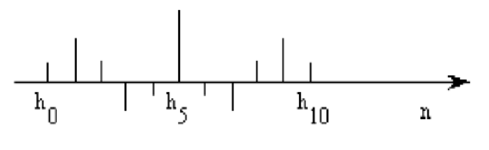{fig-align="center"}

:::

:::

## Type II

::: {.columns}

::: {.column}
 
$N$ even, symmetric ($d=1$)

::: {.small}
$$
H(\eipiv) = e^{- i 2 \pi \nu \frac{N-1}{2}} \sum_{n=1}^{\frac{N}{2}} b_n \cos\left(2\pi \nu \left(n - \frac12\right)\right)
$$
::: 

Property: 
$$ 
  H(-1)=0 \quad (\nu=\frac12)
$$

Use: low-pass, band-pass

:::

::: {.column}
 
 

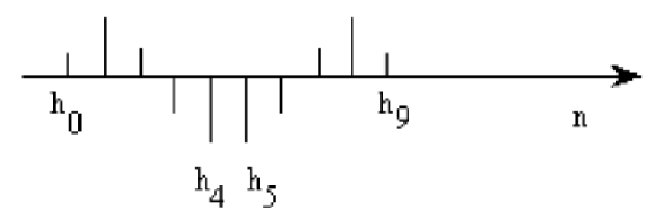{fig-align="center"}

:::

:::

## Type III

::: {.columns}

::: {.column}
 
$N$ odd, anti-symmetric ($d=i$)

$$
H(\eipiv) = e^{- i 2 \pi \nu \frac{N-1}{2}} \sum_{n=1}^{\frac{N-1}{2}} c_n \sin (2 \pi \nu n)
$$

Property:
$$
  H(1)=H(-1)=0 \quad (\nu=0 \text{ or } \frac12)
$$

Use: 

  - Differentiator: $H(f)=i 2 \pi f$
  - Hilbert transform: $H(f)= - i \sign(f)$ in band-pass form

:::

::: {.column}
 
 

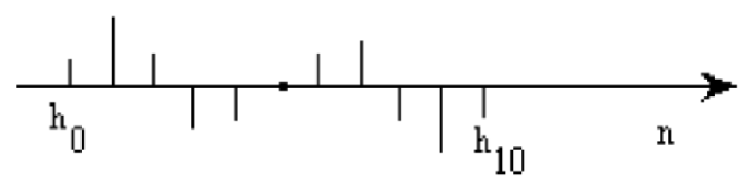{fig-align="center"}

:::

:::

## Type IV

::: {.columns}

::: {.column}
 
$N$ even, anti-symmetric ($d=i$)

::: {.small}
$$
H(\eipiv) = e^{- i 2 \pi \nu \frac{N-1}{2}} \sum_{n=1}^{\frac{N}{2}} d_n \sin\left(2\pi \nu \left(n - \frac12\right)\right)
$$
:::

Property: $H(1)=0 \quad (\nu=0)$

Use: 

  - Differentiator: $H(f)=i 2 \pi f$
  - Hilbert transform: $H(f)= - i \sign(f)$ in high-pass form

:::

::: {.column}
 
 

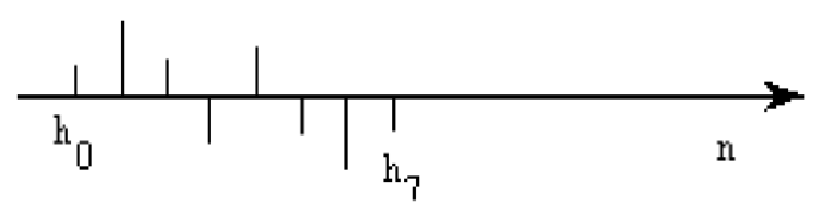

:::

:::

:::

## Differentiators {.small-slide}

::: {.notes}

We will now see two special filters that we mentioned before.

The first ones are differentiation filters

Filters type III and IV can be used to approximate the frequency response $H(\eipiv)=i 2 \pi \nu$, which corresponds to the derivation operation

Therefore we can use one of the previous filters with $d=i$

:::

$$
  d=i \quad\implies\quad H(\eipiv)= i 2 \pi \nu
$$

. . .

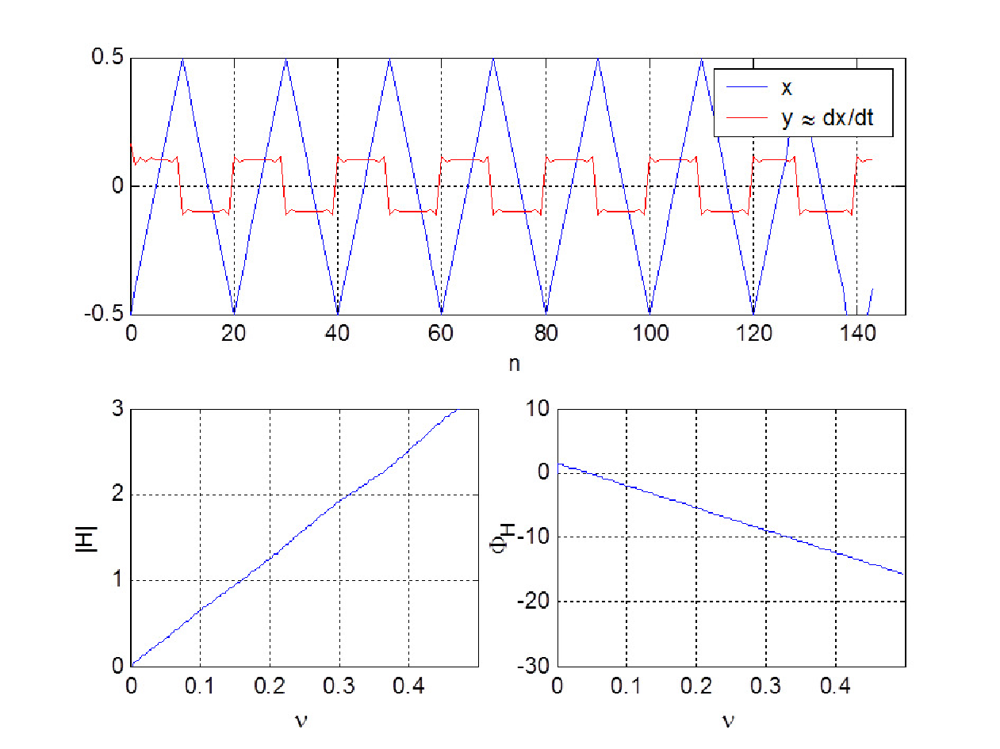{fig-align="center" width=50%}

::: {.center .small}
Differentiator filter of order 20 applied to a triangle sequence
:::

::: {.notes}

As you can see, if we filter a triangular waveform, we get almost a train of door functions, as expected

These filters feature a zero in the frequency response at $0.5$, so the highest frequency of the passband is fixed at $\nu=0.45$

Also, as you can notice, the Gibbs phenomenon is evident in the transition of the square sequence
:::

## Hilbert transform {.small-slide}

::: {.notes}

These filters perform an approximation of the Hilbert transform, which gives access to the analytic signal.

An analytic signal is the complex signal associated with a real signal, 

- that has no negative frequency components
- and whose real and imaginary parts are real functions related via the Hilbert transform

We can use the filters Type III and Type IV to extract the hilbert transform (proof in the notes)

Then filtering a real signal $x(n)$ provides a signal $x_h(n)$ such that 
$$
  x_a(n) = x(n) + i x_h(n), \quad x_h(n) = \{h \ast x\}(n)
$$

:::

$$
x_a(n) = x(n) + i x_h(n), \quad x_h(n) = \{h \ast x\}(n)
$$

. . .

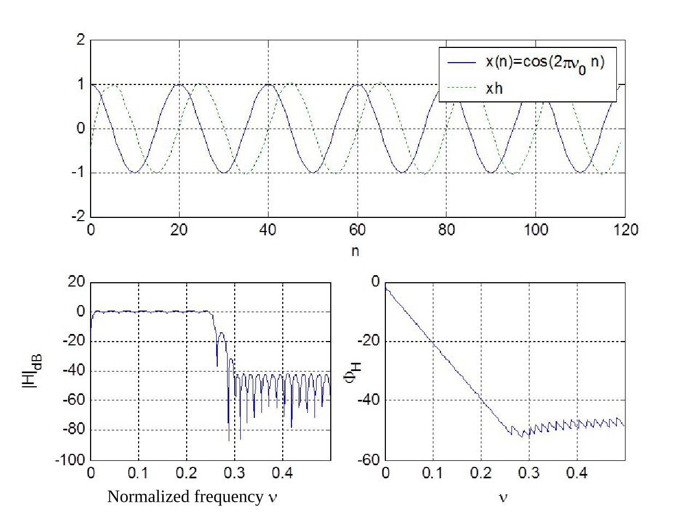{fig-align="center" width=50%}

::: {.center .small}
Hilbert filtering of sinusoidal sequence $x(n)$ of freq. $\nu_0=0.05$, filter length $N=61$
:::

::: {.notes}

This figure here shows the results and the frequency response of the Hilbert filter implementing a passband filter:

This means that we perform the Hilbert transform on the selected frequencies

In reality, the filter has a transient state and the steady state is reached only after $N-1$ samples, because of the ripples in the passband

These imperfections are hardly visible because of the chosen order of the filter here.

:::

## Position of the zeros

Complex zero outside the unit circle

$$
  (1 - \rho e^{i \theta} z^{-1})
  (1 - \rho e^{-i \theta} z^{-1})
  (1 - \frac1\rho e^{i \theta} z^{-1})
  (1 - \frac1\rho e^{- i \theta} z^{-1})
$$

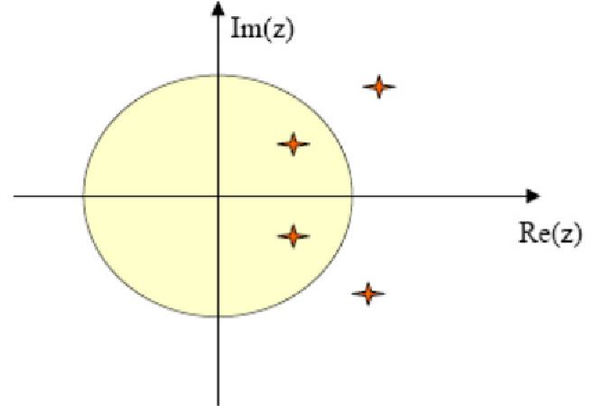{width="50%" fig-align="center"}

::: {.notes}

These filters have a properties related to the position of the zeros

Let $\rho$ be a zero of $H(z)$

Since $h(n)$ is real, then also ${\rho^\ast}$ is a zero of $H(z)$

Since $h(n)$ is either symmetric or anti-symmetric, if $\rho\ne 0$ then also $1/\rho$ and $1/{\rho^\ast}$ are zeros of $H(z)$

We can easily prove it by
$$
H\left(\frac{1}{\rho}\right)
  = \sum_{n=0}^{N-1} h(n)\,\rho^{n}
  = \sum_{m=0}^{N-1} h(N - 1 - m)\,\rho^{N-1-m}
  = \pm\,\rho^{N-1}\sum_{m=0}^{N-1} h(m)\,\rho^{-m}
  = \pm \rho^{N-1} H(\rho)
$$
for $m = N - 1 - n$

This means that for these type of filters, one zero is always accompained by four of them.
:::

## Position of the zeros

::: {layout-ncol="3"}

::: {.column}
Zero on the unit circle

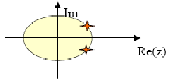

:::

::: {.column}
Real zero

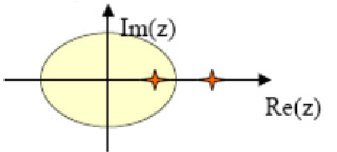 

:::

::: {.column}
Real zero on the unit circle

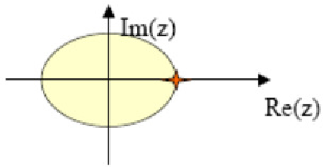
:::

:::

## Summary {.tiny-slide}

::: {layout-ncol="4" layout-align="center" style="text-align:center"}

Types

Example

Properties

Applications

:::

::: {layout-ncol="4" layout-align="center" style="text-align:center"}

Type I\
$N$ odd\
symmetric

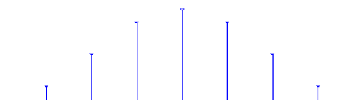

-

Low-Pass\
High-pass\
Band-pass

:::

::: {layout-ncol="4" layout-align="center" style="text-align:center"}

Type II\
$N$ even\
symmetric

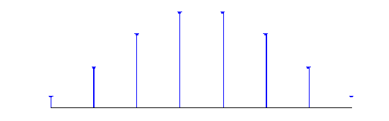

$H(-1) = 0$

Low-Pass\
Band-pass

:::

::: {layout-ncol="4" layout-align="center" style="text-align:center"}

Type III\
$N$ odd\
anti-sym.

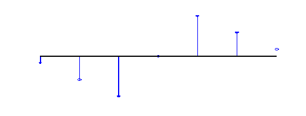

$H(1)=H(-1) = 0$

Differentiator\
Hilbert transform\
Band-pass

:::

::: {layout-ncol="4" layout-align="center" style="text-align:center"}

Type IV\
$N$ even\
anti-sym.

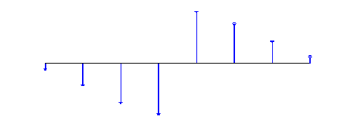

$H(1) = 0$

Differentiator\
Hilbert transform\
High-pass

:::

# Part II - FIR filters: iterative methods {.section-slide}

::: {.notes}

Iterative methods are methods that allow to synthetize filters based on some properties

These methods optimize a criterion, called the Chebyshev error criterion, to estimate the filter coefficients based on some constraints.

The criterion is optimized using iterative algorithms like the Remez exchange algorithm

:::

## Iterative methods {.small-slide}

[Advantages]{.fg}

- Optimal design
- Flexible method
- Constant amplitude ripples
- Minimum order for a given *template*

::: {.notes}

The iterative methods benefit from the following advantages

- they achieve an optimal design, in terms of error variance and global minimum
- are relatively flexible thanks to the template to define the shape of a filter
- they guarantee ripples of constant amplitude
- and return the minimum order filter for the given template
:::

. . .

[Drawbacks]{.fg}

- Computationally demanding **synthesis**
- Not suitable for real-time processing
- Not suitable for long filters ($\to$ numerical stability issues)

::: {.notes}

Of course there is no free lunch

The drawbacks are that

- the synthesis is computationally demanding (that is, computing filter)
- therefore they are not suitable for real-time processing
- and suffer from numerical instability for high-order filters

:::

## Filter template {.small-slide}

::: {.notes}

Let's start with the definition of the filter template

that allow us to parameterize the shape of the desired filter

:::

. . .

::: {.notes .small}

For instance, let's consider here a low-pass filter, which used to generalize to other types of filter later

- the limits of the modulus of the frequency response are given in terms of 
  - maximum ripple $\delta_1$ in the passband 
  - and maximum ripple $\delta_2$ in the stopband

Typically these parameters are defined in dB

The width of the transition band which will be very narrow for a more selective filter

- defined between two frequencies $\nu_c$ and $\nu_a$

This template typically assumes a unitary gain and is normalized to 1 in the passband

:::

::: {layout="[50,50]" layout-valign="center"}

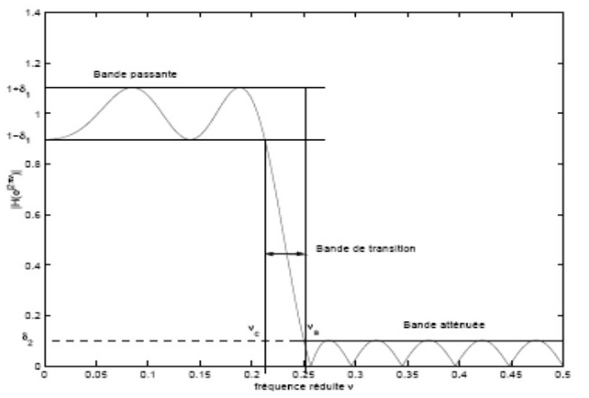

:::

## Parameterization of $H_R$ {.small-slide}

::: {.notes}

Then, we can notice that the H_R of the four types of FIR filters can be parameterized as the product of two filters P and Q

and whose forms are given in this table

In particular:

- Q is specific to each type of filter
:::

Factorization $H_R(\nu)=P(\nu)Q(\nu)$

::: {.small}
$$
\begin{array}{|c|c|c|}
\hline
H_R(\nu) & P(\nu) & Q(\nu) \\ \hline
\sum\limits_{n=0}^{\frac{N-1}{2}} a_n \cos(2\pi \nu n) & \sum\limits_{n=0}^{\frac{N-1}{2}} a_n \cos(2\pi \nu n) & 1 \\
\sum\limits_{n=1}^{\frac{N}{2}} b_n \cos\left(2\pi \nu \left(n-\frac{1}{2}\right)\right) & \sum\limits_{n=0}^{\frac{N}{2}-1} b'_n \cos(2\pi \nu n) & \cos(\pi \nu) \\
\sum\limits_{n=1}^{\frac{N-1}{2}} c_n \sin\left(2\pi \nu n\right) & \sum\limits_{n=0}^{\frac{N-3}{2}} c'_n \cos(2\pi \nu n) & \sin(2\pi \nu) \\
\sum\limits_{n=1}^{\frac{N}{2}} d_n \sin\left(2\pi \nu \left(n-\frac{1}{2}\right)\right) & \sum\limits_{n=0}^{\frac{N}{2}-1} d'_n \cos(2\pi \nu n) & \sin(\pi \nu) \\ \hline
\end{array}
$$
:::
. . . 

::: {.small}
$$  
  \boxed{P(\nu) = \sum_{n=0}^M a_n \cos(2 \pi \nu n)}
$$
:::

::: {.notes}

and the $P$ are trigonometric polynomial functions whose general expression is common to all the filters

:::

## Remez method {.tiny-slide}

[Problem formulation:]{.fg} minimization of the (Chebyshev) error
$$
  H(\eipiv) = e^{- i 2 \pi \nu \frac{N - 1}{2}}H_R(\nu) \\ \\
  E(\nu)= W(\nu) | H_D(\nu)  - H_R(\nu)|
$$

with $N$, $\nu_c$, and $\nu_a$ fixed.

::: {.notes}

Now that we have a general shapes for the filters, we can define the Remez method.

We want to optimize a FIR filter $H$ of length $N$ whose frequency response is given by
$$ H(\eipiv) = e^{- i 2 \pi \nu \frac{N - 1}{2}} H_R(\nu)$$

Then, the optimization criterion is based on the error which

- measure the deviation between the zero-phase part of the obtained responses and the ideal function

:::

. . .

- The wheighting function $W(\nu) \ge 0$ is set to 
  - $W(\nu)=1/\delta_1$ in passband, $W(\nu)=1/\delta_2$ in stopband
  - $W(\nu)=0$ in transition band

::: {.notes}

The positive function $W$ weights the error according to the frequencies, for instance

- 1 over $\delta_1$ in the pass band
- 1 over $\delta_2$ in the stop band
- 0 in the transition band

:::

. . .

- With $H_R(\nu) = Q(\nu)P(\nu)$, we get:

$$
\begin{align}
  E(\nu)
    &= W(\nu) (H_D(\nu) - P(\nu)Q(\nu))\\
    &= W'(\nu)(H'_D(\nu) - P(\nu))
\end{align}
$$

::: {.notes}

With the factorization of H_R into P and Q we get this expression for the error

where we can define $W'= W Q$ and $H'_D = H_D / Q$, considering $Q$ implicitly

:::

## Alternance theorem {.tiny-slide}

Minimization in Chebyshev sense:
$$
  H(\eipiv) = \min_H \| E(\nu) \|_\infty
$$
on a closed set of frequencies $B$

::: {.notes}

Then the problem is: we are looking for the filter

- whose frequency response minimizes the infinity norm (that is the maximum error) of the weighted Chebyshev error
- on a frequency band B

:::

. . . 

::: {.callout}
### Alternance theorem

The unique and best approximation is obtained when there exist $M+2$ frequencies $\nu_0, \ldots, \nu_{M+1}$ in $B$ such that $E(\nu_k)= \pm (-1)^k \delta$ where $\delta = \| E(\nu) \|_\infty$

:::

::: {layout="[50,50]" style="margin-top:-3em;" .v-center}

{fig-align="center"}

{fig-align="center"}

:::

::: {.notes}

The alternation theorem shows that this optimization problem on a closed set of frequency admits a unique solution, which is such that there exists $M+2$ points where the error reaches the worst values exactly 

and where it does, it does with alternating sign. 
:::

. . .

::: {.notes}

So the error has an equi-ripple behaviour, as shown here

But consider that:

- it is the weighted error to be equiripple, so then the ripples are $\delta \delta_1$ in the passband and $\delta \delta_2$ in the stopband
- M+2 is shared across the passband and the stop band
- $H_R$ is real, not positive, so it oscillates through zero
  - sometimes this is not evident when plotting the magnitude of the filter $H$

:::

## Remez algorithm {.small-slide}

::: {.notes}

Then the Remez exchange algorithm empirically searches for a solution for this problem

While there is no proof of convergence, it typically converges in a few iterations

:::

. . .

Input: 
  
  - Filter length $N$, filter family ($M, Q$ and basis for $P$), band $B$ ($\nu_c, \nu_a$)
  - Desired ideal response $D(\nu)$ and weighting $W(\nu)$

Output: $M+1$ coefficients for $P$

::: {.notes}

So as input we have ...

:::

. . .

1. Initialization: the $M+2$ alternances are set uniformly in $B$
2. Iteration
    1. Direct resolution of the linear system $\sum_{n=0}^{M} a_n \cos(2 \pi \nu_k n) + \frac{(-1)^k \delta}{W(\nu_k)} = H_D(\nu_k)$\
      (or solution by Lagrange interpolation)
    2. Search of the extrema of this polynomial
    3. Choice of the new values of the $\nu_k$
3. Convergence in a few iterations

::: {.notes}

Then for the actual algorithms

1. In the initialization we spread $M+2$ candidate frequencies uniformly over the band $B$
2. Then solve a linear system evaluating the polynomial at the candidate frequencies with respect to the coefficients $a_k$
3. evaluate the error function on the dense grid of frequencies and compute maximum error
4. Take the new values of candidate frequencies that maximize the error
5. Stop when the max error falls under a tolerance

The final filter impulse response $h(n)$ is recovered from the $a_k$ and the symmetry relation

:::

## Remez method - illustration

<iframe class="r-stretch" src="widgets/cm02_remez_exchange_mechanism_stepper.html" width="100%"
        style="border:none;" loading="lazy"></iframe>

## Remez method - example low-pass filter

<iframe src="widgets/cm02_remez_lowpass_interactive_designer.html" width="100%" height="560"
        style="border:0;background:transparent" loading="lazy"></iframe>

<!-- ::: {.r-stack}
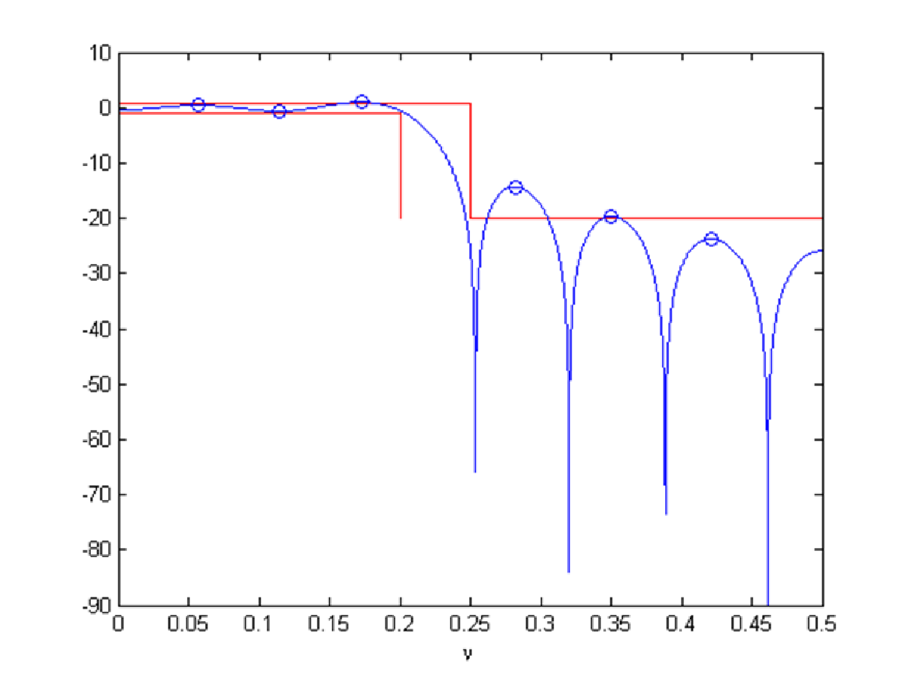{.fragment width="70%"}

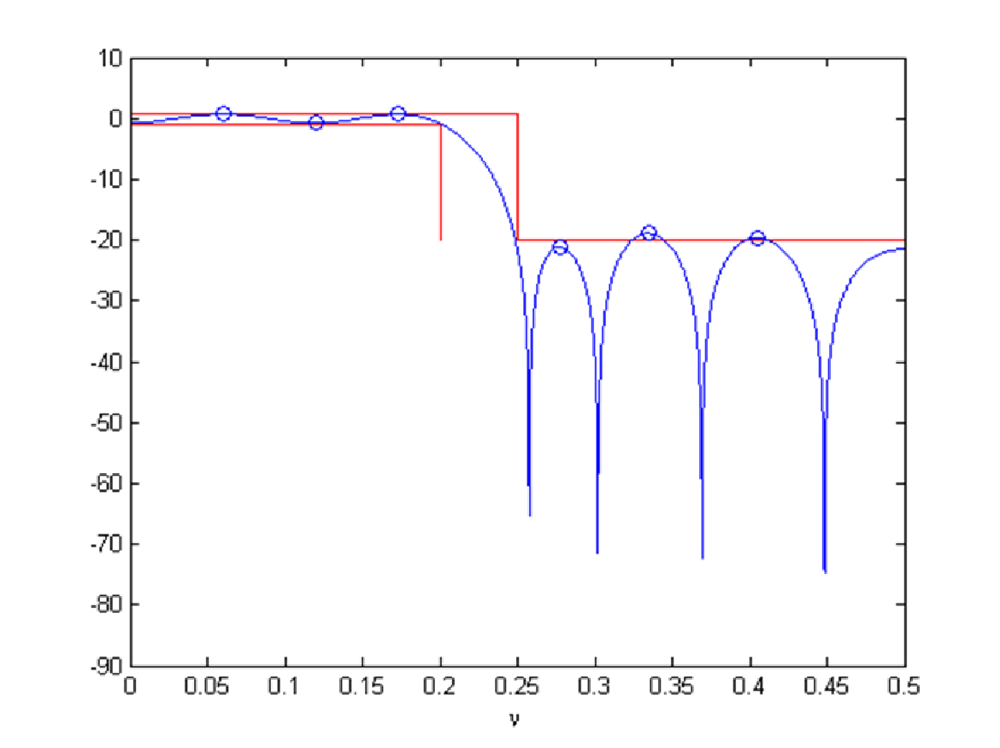{.fragment width="70%"}

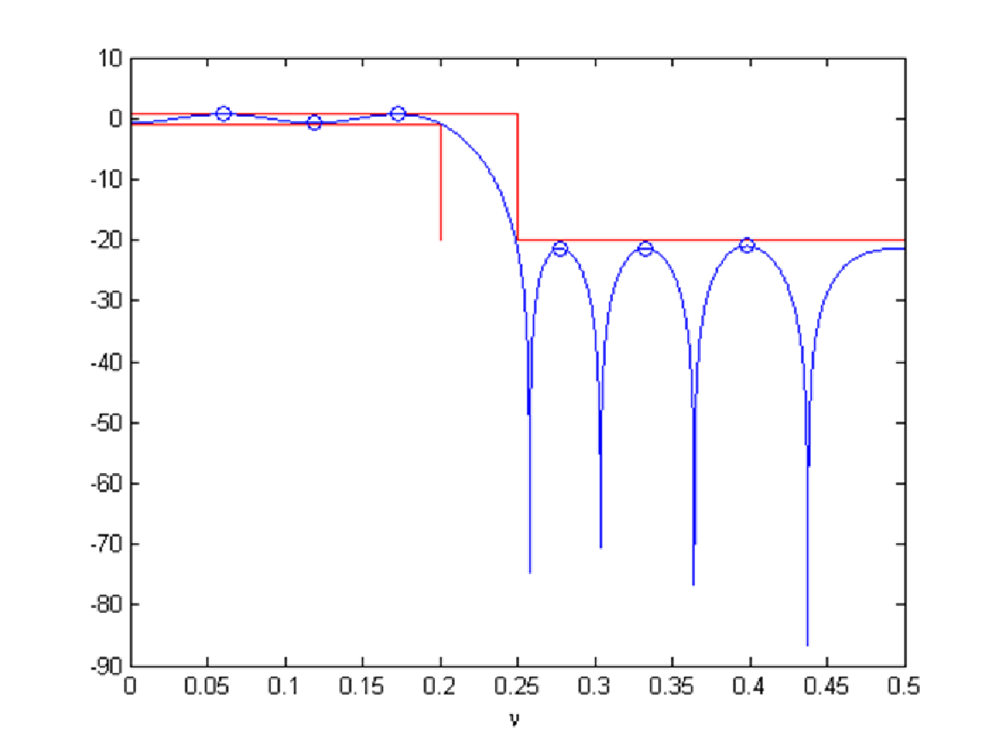{.fragment width="70%"}

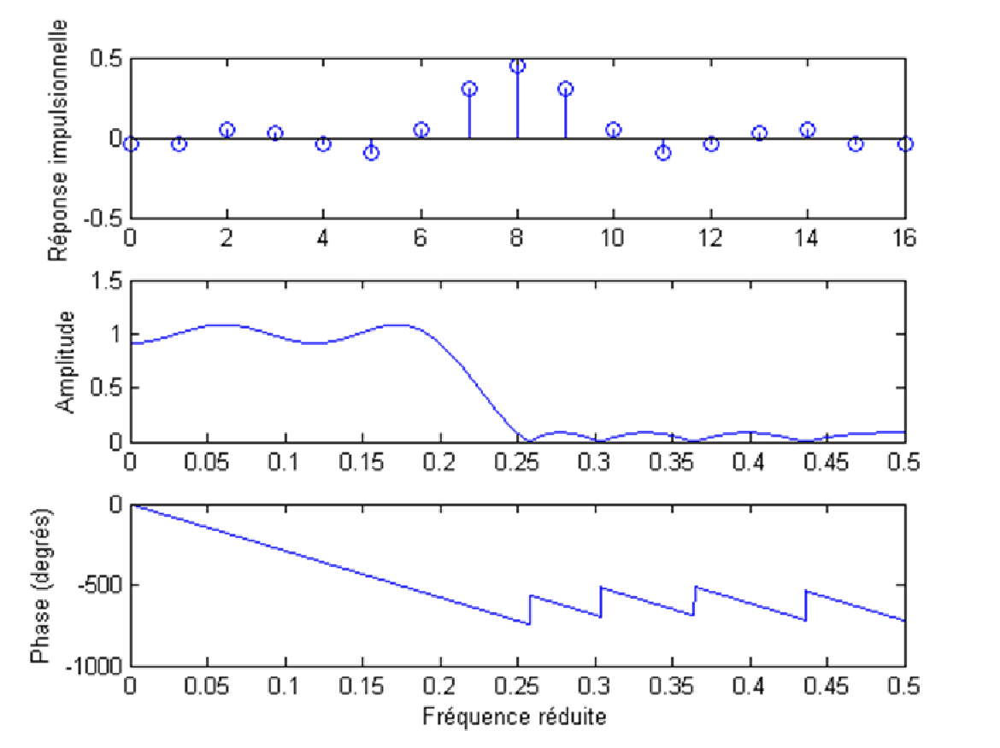{.fragment width="70%"}

::: -->

# Part III - Eigenvalue methods {.section-slide}

Window optimization under constraint

[Skip]{.warning} $\to$ [part of the first tutorial]{.warning}

## Prolate spheroidal sequences {.blurred}

Skip $\to$ part of the first tutorial

## Optimal eigen-filter {.blurred}

Skip $\to$ part of the first tutorial

# Part IV - Synthesis of recursive filters {.section-slide}

::: {.notes}

In this last part, we will study recursive filters

We will see only the general ideas, as professor Badeau will present them more in detail later in the course

:::

##  Generalities {.small-slide}

::: {.notes}

Let's start with 2 examples

:::

[Example]{.fg}

$N(z) = \prod_k (1 - z_k z^{-1})$ with zeros at frequencies $[0.1, 0.2, 0.3, 0.4, 0.5]$

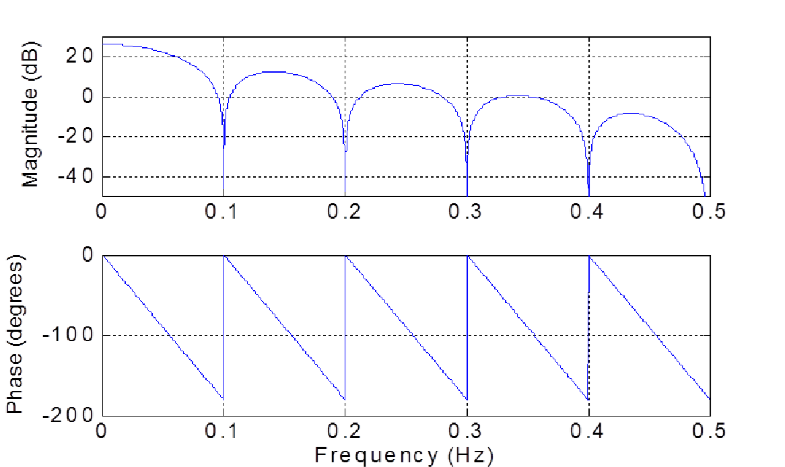{width="60%" fig-align="center"}

::: {.notes}

This example shows the frequency response of a filter with zeros at the normalized frequencies 0.1, 0.2, 0.3, 0.4 and 0.5 (and their conjugates)

The filter has a zero on the unit circle at this frequencies, then its frequency response presents a cancellation at $\nu_k$

We can leverage this fact to create stopbands by setting the the zeros in the stopband

However the response is not flat in the passband

:::

##  Generalities {.small-slide}

[Example]{.fg}

$H(z) = N(z)/D(z)$ where $D(z)=(1 - p z^{-1})(1 - p^\ast z^{-1})$, with $p = 0.95 e^{i 2 \pi 0.085}$

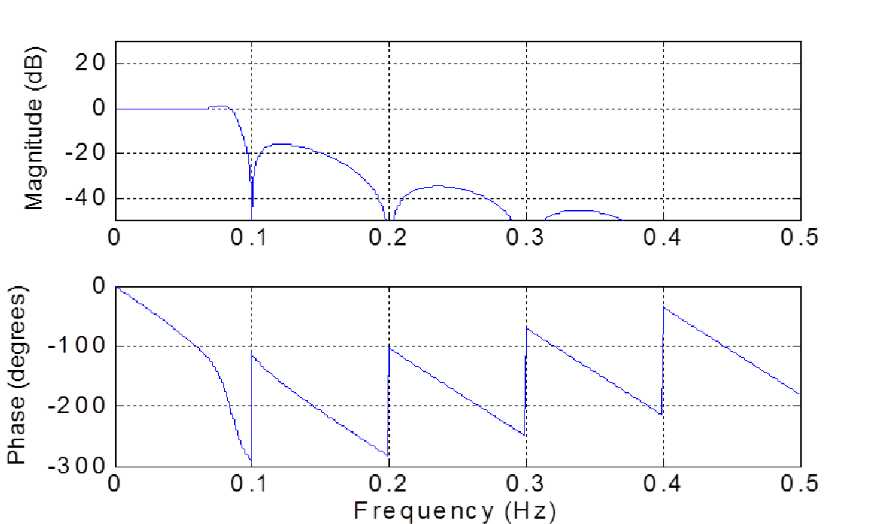{width="60%" fig-align="center"}

::: {.notes}

To overcome this we can add a pole to the filter, by dividing it, so that the modulus of the denominator approximates the one of the numerator (in the passband)

For instance we can choose the denominator with 2 conjugate poles, and if their modulus is smaller than 1 we get a stable causal filter

Then by building the filter as this ratio, we can see that we obtain a flattening of the passband

- but a non-linear phase in the neighborhood of $\nu=0.085$, which is the frequency of the pole

:::

## Low-pass recursive filters {.small-slide}

Position of the poles and zeros

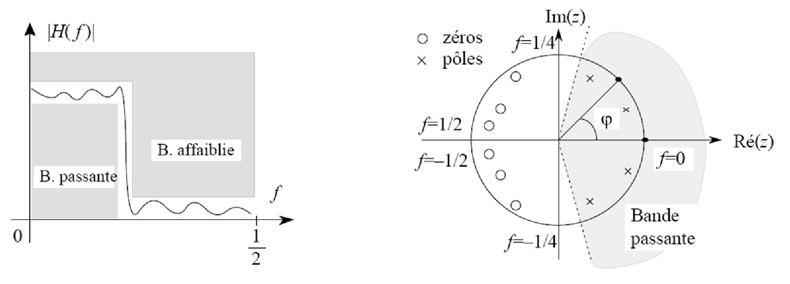{width="100%" fig-align="center"}

::: {.notes}

With this type of design we put

- poles in the passband to compensate the zeros
- and in the vicinity of the transition band of the filter, 
  - in this way, the cutoff will be even more selective the closer the poles are to the unit circle.

However, as payoff, the pole creates a ripple, that is a resonance frequency

This may be wanted... and can be quite musical!

:::

## Example : Low-pass with resonance {.small-slide}

<iframe src="widgets/cm02_fm_acid_bass_pole_zero_with_spectrum_and_scope.html" width="100%" height="100%" style="border:0"></iframe>

## Rejector filter (audio feedback) {.small-slide}

::: {.notes}

We saw before that the designed recursive filter is able to create a zero in the frequency response at a specific frequency

In other words, it can remove a selected frequency in the signal

There is an application for this, when we have a signal which is corrupted by a pure sinusoidal component: the acoustic feedback

:::

$$
  H(z) = \frac{
    (1 - e^{i 2 \pi \nu_c} z^{-1})(1 - e^{- i 2 \pi \nu_c} z^{-1})
  }{
    (1 - \rho e^{i 2 \pi \nu_c} z^{-1})(1 - \rho e^{- i 2 \pi \nu_c} z^{-1})
  }
$$

Remark: the IR will be long if $\rho \to 1$

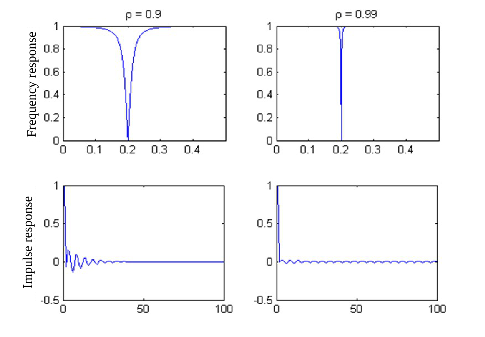{fig-align="center" width="50%"}

## Rejector filter (audio feedback) - Example {.small-slide}

<iframe src="widgets/cm02_notch-feedback-demo.html" width="100%" height="100%" style="border:0"></iframe>

## Bilinear transform {.blurred}

## Bilinear transform {.blurred}

## From continuous to discrete domain 

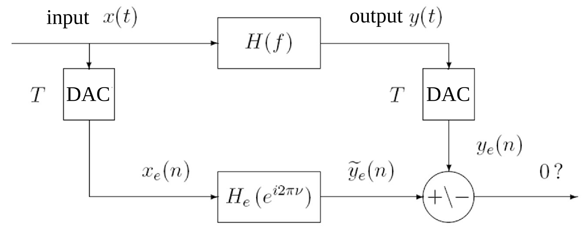

## The end {.unlisted .center}

Questions?